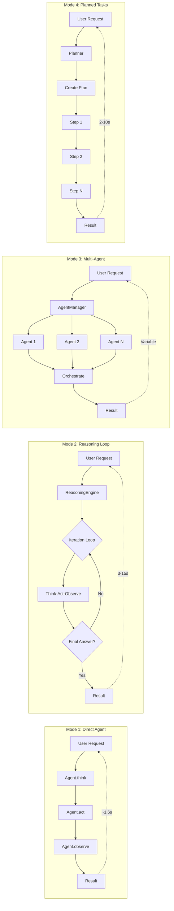

# Operone Platform - Comprehensive Project Proposal

**Generated:** November 27, 2025  
**Version:** 0.1.0  
**Project Type:** AI-Powered Desktop & Web Platform (Monorepo)

---

## 📋 Executive Summary

Operone is a sophisticated, full-stack AI-integrated platform designed as a modern monorepo featuring web and desktop applications with robust authentication, comprehensive UI components, and cross-platform support. The platform seamlessly combines Next.js web applications, Electron desktop apps, and a cutting-edge AI/MCP (Model Context Protocol) integration system.

### Key Highlights
- **3 Applications**: Web app, Desktop app, Documentation site
- **5 Core Packages**: Operone engine, MCP tools, Types, ESLint/TypeScript configs
- **55+ UI Components**: Shared shadcn/ui component library
- **Multi-Provider AI**: OpenAI, Anthropic, Google, Mistral support
- **Advanced Auth**: OAuth (Google, GitHub) + WebAuthn/Passkey
- **RAG System**: Retrieval-Augmented Generation with vector search
- **Event-Driven**: Pub/Sub architecture with Redis
- **Docker Support**: Local development with Qdrant, Redis, PostgreSQL

---

## 🏗️ System Architecture Overview

### Monorepo Structure

```
operone/
├── apps/                          # Application layer
│   ├── web/                       # Next.js web application
│   ├── operone/                   # Electron desktop app
│   └── docs/                      # Documentation site
├── packages/                      # Shared packages
│   ├── operone/                   # Core AI & reasoning engine
│   ├── mcp/                       # Model Context Protocol tools
│   ├── types/                     # Shared TypeScript types
│   ├── eslint-config/             # ESLint configurations
│   └── typescript-config/         # TypeScript configurations
├── tests/                         # Testing infrastructure
│   ├── e2e/                       # End-to-end tests
│   └── integration/               # Integration tests
├── docker-compose.yml             # Local infrastructure
├── turbo.json                     # Turborepo configuration
├── pnpm-workspace.yaml            # pnpm workspace config
└── vitest.config.ts               # Test configuration
```

### Technology Stack

#### Frontend Technologies
| Technology | Version | Purpose |
|:-----------|:--------|:--------|
| **React** | 19.2.0 | UI framework |
| **Next.js** | 16.0.1 | Web framework (App Router) |
| **TypeScript** | 5.9.3 | Type safety |
| **Tailwind CSS** | 3.4.18 | Styling |
| **shadcn/ui** | Latest | Component library (55+ components) |
| **Electron** | 34.0.0 | Desktop framework |
| **Vite** | 6.0.11 | Build tool (Electron) |

#### Backend Technologies
| Technology | Version | Purpose |
|:-----------|:--------|:--------|
| **Node.js** | ≥18 | Runtime environment |
| **MongoDB** | 7.0.0 | Primary database (web app) |
| **Prisma** | 5.22.0 | Database ORM |
| **NextAuth** | 5.0.0-beta.30 | Authentication |
| **PostgreSQL** | 15 | Structured data (Docker) |
| **Redis** | Alpine | Event bus & cache |
| **Qdrant** | Latest | Vector database |

#### AI/ML Technologies
| Technology | Version | Purpose |
|:-----------|:--------|:--------|
| **Vercel AI SDK** | 5.0.100 | AI integration |
| **@ai-sdk/openai** | 2.0.71 | OpenAI integration |
| **@ai-sdk/anthropic** | 2.0.45 | Anthropic integration |
| **@ai-sdk/google** | 1.0.11 | Google AI integration |
| **@ai-sdk/mistral** | 1.0.9 | Mistral integration |

---

## 🚀 Applications Architecture

### 1. Web Application (`apps/web`)

**Port:** 3000  
**Framework:** Next.js 16 with App Router  
**Database:** MongoDB with Prisma ORM

#### Core Features
- ✅ **Advanced Authentication System**
  - OAuth providers: Google, GitHub
  - WebAuthn/Passkey support
  - Session management with device tracking
  - Desktop auth token generation
  - Passkey management (create, edit, delete)
  
- ✅ **User Dashboard**
  - Profile management
  - AI provider configuration
  - Session management (view/revoke devices)
  - Security settings
  
- ✅ **AI Provider Management**
  - Multi-provider support (OpenAI, Anthropic, Google, Mistral, Ollama, Custom)
  - Encrypted API key storage
  - Provider activation/deactivation
  - Connection testing
  
- ✅ **Modern UI System**
  - 55+ shadcn/ui components
  - Dark/light theme support
  - Responsive design
  - Error boundaries

#### Database Schema
**Models:**
- `User`: User accounts with OAuth/Passkey support
- `Account`: OAuth provider accounts
- `Session`: User sessions with device tracking
- `Authenticator`: WebAuthn/Passkey credentials
- `DesktopAuthToken`: Desktop app authentication tokens
- `AIProvider`: User AI provider configurations
- `VerificationToken`: Email verification tokens

### 2. Desktop Application (`apps/operone`)

**Framework:** Electron 34 + Vite + React 19  
**Protocol:** `operone://` custom deep-link

#### Key Features
- ✅ **Electron Desktop Framework**
  - Cross-platform support (macOS, Windows, Linux)
  - Native system integration
  - Custom protocol handler
  
- ✅ **Deep-Link Authentication**
  - Browser-based OAuth flow
  - Secure token exchange via `operone://auth?token=...`
  - Persistent session storage (electron-store)
  
- ✅ **AI Chat Interface**
  - Multi-provider AI chat
  - Streaming responses
  - Token counting
  - Markdown rendering
  - Code syntax highlighting

### 3. Documentation Site (`apps/docs`)

**Port:** 3001  
**Framework:** Next.js 16

#### Features
- ✅ **Component Library Showcase**
  - Live demos of 55+ UI components
  - Interactive component playground
  - Code examples
  
- ✅ **Development Guide**
  - Usage examples
  - Best practices
  - API documentation

---

## 🤖 AI Integration Architecture

### Multi-Provider Support

| Provider | SDK | Models Supported | Status |
|:---------|:----|:-----------------|:-------|
| **OpenAI** | @ai-sdk/openai | GPT-4, GPT-3.5, etc. | ✅ |
| **Anthropic** | @ai-sdk/anthropic | Claude 3.5, Claude 3 | ✅ |
| **Google** | @ai-sdk/google | Gemini Pro, etc. | ✅ |
| **Mistral** | @ai-sdk/mistral | Mistral models | ✅ |
| **Ollama** | Custom | Local models | ✅ |
| **OpenRouter** | Custom | Multi-provider | ✅ |

### Model Provider Interface

**Unified API:**
```typescript
interface ModelProvider {
  generate(prompt: string, context?: any[]): Promise<Response>
  stream(prompt: string, context?: any[]): AsyncIterator<Token>
  embed(text: string): Promise<number[]>
}
```

---

## 🧠 Core AI Engine (`@repo/operone`)

### Module Structure

```
packages/operone/src/
├── agents/                    # AI Agents
│   └── OSAgent.ts            # Operating system agent
├── core/                      # Core systems
│   ├── AgentManager.ts       # Agent lifecycle management
│   ├── EventBus.ts           # Event-driven integration
│   ├── ToolRegistry.ts       # Tool metadata & schemas
│   └── WorkerPool.ts         # Parallel execution
├── memory/                    # Memory systems
│   ├── MemoryManager.ts      # Multi-tier memory
│   ├── SessionMemory.ts      # Session-scoped memory
│   └── EntityExtractor.ts    # Entity extraction
├── rag/                       # RAG Pipeline
│   ├── RAGEngine.ts          # Main RAG orchestrator
│   ├── VectorStore.ts        # Vector database interface
│   ├── Chunker.ts            # Document chunking
│   └── *.test.ts             # Unit tests
├── reasoning/                 # Reasoning engine
│   └── ReasoningEngine.ts    # Agent reasoning loop
├── thinking/                  # Planning
│   └── Planner.ts            # Goal → Subtasks
├── model-provider.ts          # Multi-provider AI interface
├── server.ts                  # API server
├── worker.ts                  # Worker thread entry
└── index.ts                   # Public exports
```

### Agent System Features

**Agent Management** (Status: 🟢 Implemented)
- `AgentManager`: Lifecycle APIs (create, start, pause, resume, stop)
- `ReasoningEngine`: Step execution, tool calls, resource quotas
- `OSAgent`: Operating system interactions
- `Planner`: Goal decomposition and verification
- `ToolRegistry`: Tool metadata and permission scopes
- `WorkerPool`: Parallel agent execution
- `EventBus`: Structured logging and trace IDs

### RAG Pipeline Architecture

#### Pipeline Components

**Ingestion Pipeline**
```
Document → Loader → Normalizer → Chunker → Embedder → Indexer → Vector DB
```

**Retrieval Pipeline**
```
Query → Embedder → Vector Search → Reranker → Context Builder → Response
```

#### Features
- **Hybrid Search**: Vector + lexical + recency scoring
- **Batch Ingestion**: Efficient bulk document processing
- **Metadata Filtering**: Date, tags, source filtering
- **Embedding Cache**: Content-hash based caching

### Memory System Architecture

**Three-Tier Memory System**
- **Working Memory**: Per-task, ephemeral (in-memory array)
- **Session Memory**: Per-user sliding window
- **Long-Term Memory**: Vector store + knowledge graph

**Features**
- Periodic consolidation and summarization
- Entity extraction and relationship tracking
- Persistent storage with SQLite

---

## 🔄 System Flow & Execution Modes

### Execution Modes Comparison



### Performance Metrics

| Operation | Average Duration | Range |
|-----------|------------------|-------|
| Agent.think() | 1.0s | 0.5s - 2.0s |
| Agent.act() | 0.1s | 0.05s - 0.5s |
| Agent.observe() | 0.01s | 0.01s - 0.05s |
| RAG Query | 1.5s | 1.0s - 3.0s |
| Document Ingestion | 2.0s | 1.0s - 5.0s |
| Reasoning Loop (3 iter) | 4.5s | 3.0s - 10.0s |
| Plan Creation | 2.0s | 1.5s - 3.0s |

---

## 🔐 Authentication & Security

### Multi-Method Authentication

#### 1. OAuth 2.0 Integration
**Providers:** Google, GitHub

#### 2. WebAuthn/Passkey Support
- Hardware security key integration
- Biometric authentication (Face ID, Touch ID)
- Passwordless login
- Cross-device synchronization

#### 3. Desktop Deep-Link Authentication
**Protocol:** `operone://auth?token=<jwt>`

### Security Features
✅ **Authentication**
- Multi-factor authentication (OAuth + Passkey)
- Secure session management
- Token-based authentication
- Session expiration

✅ **Data Protection**
- Encrypted API keys (AES-256)
- Secure credential storage
- HTTPS enforcement
- CORS protection

✅ **Access Control**
- User-scoped data isolation
- Role-based access (planned)
- API rate limiting (planned)
- Permission scopes

---

## 📊 MCP Tools Integration

### Available Tools

**FileTool** (`FileTool.ts`)
- File system operations
- Read/write/delete files
- Directory listing
- Path validation
- Permission checks

**ShellTool** (`ShellTool.ts`)
- Command execution
- Process management
- Output streaming
- Error handling
- Timeout controls

**LogTool** (`LogTool.ts`)
- Log analysis
- Pattern matching
- Log aggregation
- Real-time monitoring
- Structured logging

---

## 🧪 Testing Infrastructure

### Test Strategy

#### Unit Tests (Vitest)
**Coverage:**
- `packages/operone`: Core engine tests
- `packages/mcp`: Tool tests
- `packages/types`: Type validation

#### E2E Tests (Playwright)
**Scope:**
- Web app user flows
- Desktop app functionality
- Authentication flows
- Cross-browser testing

#### Integration Tests
**Focus:**
- Database operations
- API integration
- Cross-package functionality
- Event bus communication

### Test Coverage Status

| Package | Unit Tests | Integration Tests | E2E Tests |
|:--------|:-----------|:------------------|:----------|
| `@repo/operone` | ✅ Partial | ⏳ Planned | N/A |
| `@repo/mcp-tools` | ✅ Complete | ✅ Complete | N/A |
| `apps/web` | ⏳ Planned | ⏳ Planned | ✅ Partial |
| `apps/operone` | ⏳ Planned | ⏳ Planned | ✅ Partial |

---

## 🐳 Local Development Infrastructure

### Docker Compose Services

```yaml
services:
  # Vector Database for RAG
  qdrant:
    image: qdrant/qdrant:latest
    ports: ["6333:6333"]
    
  # Event Bus & Cache
  redis:
    image: redis:alpine
    ports: ["6379:6379"]
    
  # Relational Database
  postgres:
    image: postgres:15-alpine
    ports: ["5432:5432"]
    environment:
      POSTGRES_USER: operone
      POSTGRES_PASSWORD: operone
      POSTGRES_DB: operone
```

### Service Ports

| Service | Port | URL | Purpose |
|:--------|:-----|:----|:--------|
| Web App | 3000 | http://localhost:3000 | Next.js web application |
| Docs | 3001 | http://localhost:3001 | Documentation site |
| Desktop | 5173 | http://localhost:5173 | Vite dev server |
| Qdrant | 6333 | http://localhost:6333 | Vector database |
| Redis | 6379 | redis://localhost:6379 | Cache & event bus |
| PostgreSQL | 5432 | postgresql://localhost:5432 | Relational database |

---

## 📈 Performance Optimization Roadmap

### Identified Optimizations

#### High Priority
1. **Streaming Support**: Implement SSE for LLM responses
2. **Batch Operations**: Add batch endpoints for RAG/memory
3. **Embedding Cache**: Implement content-hash caching
4. **Async Workers**: Move heavy tasks to background workers

#### Medium Priority
5. **Database Optimization**: Switch to async SQLite or PostgreSQL
6. **Vector DB Filtering**: Push filters to Qdrant
7. **Parallel Execution**: Support parallel tool execution
8. **Memory Compression**: Implement periodic summarization

#### Low Priority
9. **Process Isolation**: Move agents to separate processes
10. **Connection Pooling**: Implement database connection pooling

### Current Performance Gaps

**Agent System:**
- ❌ Blocking execution: Sequential step processing
- ❌ No streaming: Full LLM response awaited
- ❌ In-process execution: Blocks event loop

**RAG Pipeline:**
- ❌ Sequential ingest: One document at a time
- ❌ No embedding cache: Re-computation on every ingest
- ❌ Naive retrieval: In-memory filtering
- ❌ Blocking writes: Synchronous SQLite writes

**Memory System:**
- ❌ Synchronous SQLite: Blocks main thread
- ❌ No compression: Full text storage forever
- ❌ Single connection: Shared DB connection

---

## 🚀 Deployment Strategy

### Web Application Deployment

**Recommended Platform:** Vercel

**Build Command:**
```bash
pnpm build:web
```

**Environment Variables:**
- All `.env` variables
- Database connection strings
- OAuth credentials
- API keys (if using defaults)

### Desktop Application Distribution

**Build Command:**
```bash
pnpm build:desktop
```

**Outputs:**
- `dist/`: Web build
- `dist-electron/`: Electron build
- Platform-specific installers

**Distribution:**
- **macOS**: `.dmg`, `.app`
- **Windows**: `.exe`, `.msi`
- **Linux**: `.AppImage`, `.deb`, `.rpm`

---

## 🎯 Project Roadmap

### Short-term Goals (Q1 2025)

- [ ] Complete unit test coverage (80%+)
- [ ] Implement streaming for all LLM endpoints
- [ ] Add batch operations for RAG/memory
- [ ] Optimize database queries
- [ ] Implement rate limiting
- [ ] Add API documentation (OpenAPI/Swagger)

### Medium-term Goals (Q2 2025)

- [ ] Multi-tenant support
- [ ] Advanced RAG features (hybrid search, reranking)
- [ ] Plugin system for custom tools
- [ ] Mobile app (React Native)
- [ ] Real-time collaboration
- [ ] Advanced analytics dashboard

### Long-term Goals (Q3-Q4 2025)

- [ ] Self-hosted deployment option
- [ ] Enterprise features (SSO, RBAC)
- [ ] Advanced AI features (fine-tuning, custom models)
- [ ] Marketplace for plugins/tools
- [ ] Multi-language support
- [ ] Advanced workflow automation

---

## 📊 Project Statistics

### Codebase Metrics

| Metric | Count |
|:-------|:------|
| **Applications** | 3 |
| **Packages** | 5 |
| **Total Dependencies** | ~150+ |
| **UI Components** | 55+ |
| **API Routes** | 15+ |
| **Database Models** | 7 |
| **Test Files** | 10+ |
| **Documentation Files** | 8 |

### Dependencies Breakdown

**Production Dependencies:** ~120
- React ecosystem: ~40
- UI components: ~30
- AI/ML: ~10
- Database: ~8
- Authentication: ~5
- Utilities: ~27

**Development Dependencies:** ~30
- Build tools: ~8
- Testing: ~6
- Linting: ~5
- Type definitions: ~11

---

## 🔧 Development Workflow

### Available Scripts

#### Root Level
```bash
# Development
pnpm dev                  # Run all apps
pnpm dev:web              # Web app only
pnpm dev:desktop          # Desktop app only
pnpm dev:docs             # Docs only

# Building
pnpm build                # Build all
pnpm build:web            # Web production build
pnpm build:desktop        # Desktop build
pnpm build:docs           # Docs build

# Testing
pnpm test                 # All tests
pnpm test:coverage        # Coverage reports
pnpm test:watch           # Watch mode

# Code Quality
pnpm lint                 # Lint all packages
pnpm check-types          # Type checking
pnpm format               # Format code
```

### Git Workflow

**Branch Strategy:**
- `main`: Production-ready code
- `develop`: Integration branch
- `feature/*`: Feature branches
- `fix/*`: Bug fix branches

**Commit Convention:**
```
type(scope): description

feat(auth): add passkey support
fix(rag): resolve chunking overlap issue
docs(readme): update installation steps
test(mcp): add FileTool unit tests
```

---

## 🤝 Contributing Guidelines

### Development Setup

1. **Clone Repository**
   ```bash
   git clone <repository-url>
   cd operone
   ```

2. **Install Dependencies**
   ```bash
   pnpm install
   ```

3. **Setup Environment**
   ```bash
   cp apps/web/.env.example apps/web/.env
   # Configure environment variables
   ```

4. **Start Services**
   ```bash
   docker-compose up -d
   ```

5. **Run Development**
   ```bash
   pnpm dev
   ```

### Contribution Guidelines

1. Fork the repository
2. Create feature branch: `git checkout -b feature/amazing-feature`
3. Follow code style (ESLint + Prettier)
4. Add tests for new features
5. Update documentation
6. Commit with semantic messages
7. Push to branch: `git push origin feature/amazing-feature`
8. Open Pull Request

---

## 📞 Support & Documentation

### Available Documentation

| Document | Purpose | Status |
|:---------|:--------|:-------|
| README.md | Project overview & setup | ✅ Complete |
| API_CONTRACT.md | API specifications | ✅ Complete |
| MAPPING.md | Feature mapping | ✅ Complete |
| SYSTEM_DIAGRAMS.md | System flow diagrams | ✅ Complete |
| FLOW_CONTROL.md | Feature timeline | ✅ Complete |
| STREAMING_EXAMPLES.md | Streaming examples | ✅ Complete |
| PROJECT_REPORT.md | Detailed architecture | ✅ Complete |
| KNOWN_ISSUES.md | Troubleshooting | ✅ Complete |

### Documentation Coverage

- ✅ Installation & setup
- ✅ Architecture overview
- ✅ API contracts
- ✅ Component usage
- ✅ Authentication flows
- ✅ Deployment guide
- ✅ System diagrams
- ✅ Performance metrics
- ⏳ Contributing guidelines
- ⏳ API reference
- ⏳ Troubleshooting guide

---

## 📄 License

MIT License - see [LICENSE](LICENSE) file for details.

---

## 🙏 Acknowledgments

- **Next.js Team** - Amazing framework
- **Auth.js** - Authentication solution
- **shadcn/ui** - Beautiful components
- **Electron** - Desktop capabilities
- **Vercel** - Hosting platform
- **OpenAI** - AI models
- **MCP Community** - Protocol development

---

## 📞 Support

- **Documentation**: [Visit docs site](http://localhost:3001)
- **Issues**: [GitHub Issues](https://github.com/your-org/operone/issues)
- **Discussions**: [GitHub Discussions](https://github.com/your-org/operone/discussions)
- **Community**: [Discord Server](https://discord.gg/your-server)

---

**Built with ❤️ by the Operone team**

---

*This comprehensive project proposal provides a complete overview of the Operone platform architecture, features, implementation details, and roadmap for stakeholders and development teams.*
